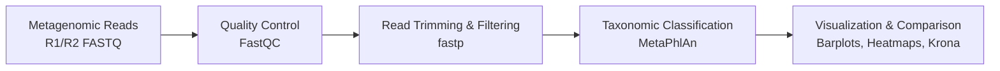
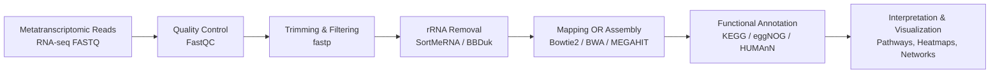

# microbyoume
Collecting interesting statitsical and graphical representations of microbiome specific data visualizations.

## Data information

Occular fluid metagenome collected from: 

> Normal eye: https://www.ebi.ac.uk/ena/browser/view/SAMN05362836?show=reads

> Infected eye: https://www.ebi.ac.uk/ena/browser/view/SAMN05362796?show=reads

## Workflows followed

Classic metagenomics workflow for shotgun reads processing

Classic RNAseq (metatranscriptomic) workflow 

