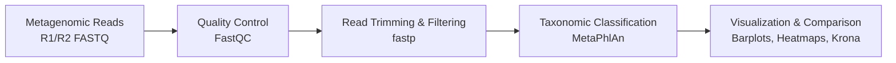
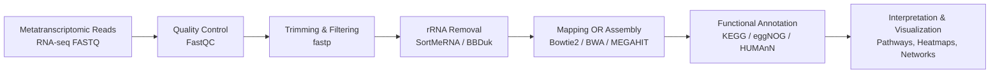

# microbyoume
Collecting interesting statistical and graphical representations of microbiome specific data visualizations.

Includes variety of tools to assess quality, profiles and biology behind samples through sequencing results.

## Data information

Occular fluid metagenome collected from: 

> Normal eye: https://www.ebi.ac.uk/ena/browser/view/SAMN05362836?show=reads

> Infected eye: https://www.ebi.ac.uk/ena/browser/view/SAMN05362796?show=reads

## Requirements loading

There is environemnt information defined for conda, which can be loaded using:
1. `conda install -n base -c conda-forge mamba` (install mamba for fast downloads)
2. `mamba env create -f qc_env.yml` (install conda env using mamba)

**Installing nextflow**
1. Install latest version of java (> v17.0) `java -version`
2. `curl -s https://get.nextflow.io | bash`
3. `mkdir -p $HOME/.local/bin/`
4. `mv nextflow $HOME/.local/bin/`
5. `export PATH="$PATH:$HOME/.local/bin"`

## Launching nextflow pipeline

1. `cd projects/microbyoume/nextflow`
2. `nextflow evaluate_metagenome.nf -c /experiments/20260623/config.nf`

## Workflows followed

Classic metagenomics workflow for shotgun reads processing

Classic RNAseq (metatranscriptomic) workflow 

