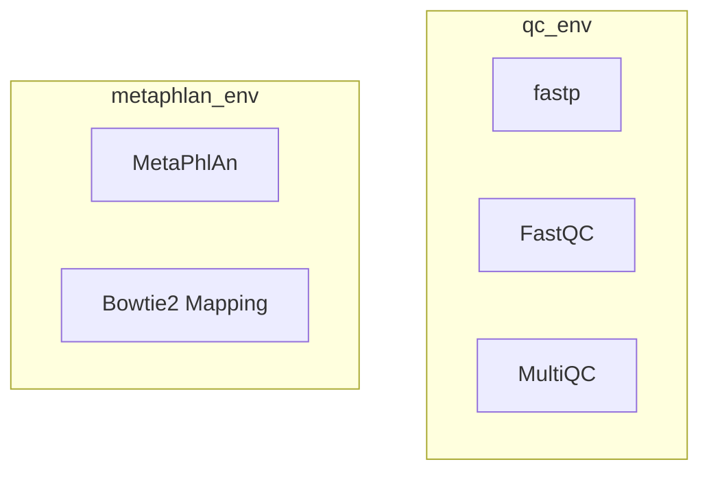
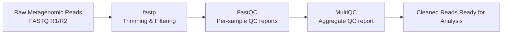
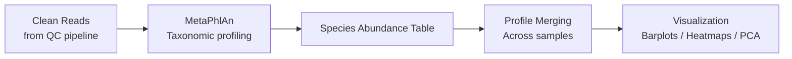

## Nextflow installation process

Please ensure you are on linux/WSL system.

In order to launch nextflow, follow below steps:

Install latest java-jre version to allow nextflow installation.
```
sudo apt update
sudo apt install -y openjdk-17-jdk
java --version
```

Now install nextflow.
```
curl -s https://get.nextflow.io | bash
sudo mv nextflow /usr/local/bin/
nextflow -version
```

### Tools installation

I have 2 main conda environments:



1. Quality check (qc_env)


> `conda create -n qc_env -c bioconda -c conda-forge fastqc fastp multiqc`

2. Classification (metaphlan_env)


> `conda create -n metaphlan_env -c bioconda -c conda-forge metaphlan bowtie2`

### Launch pipeline

If you create new experimental configs to pass paths or configure cores, launch:

> `nextflow run nextflow/evaluate_metagenome.nf -c nextflow/experiemnts/20260623/config.nf`<br>
replacing path to config file of your choice